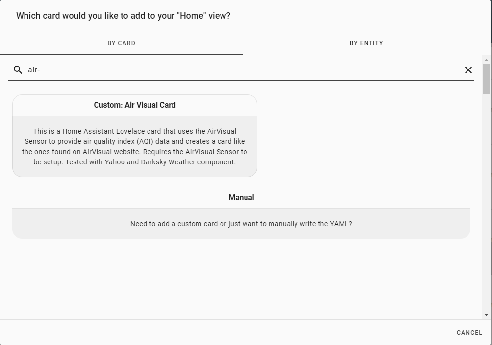
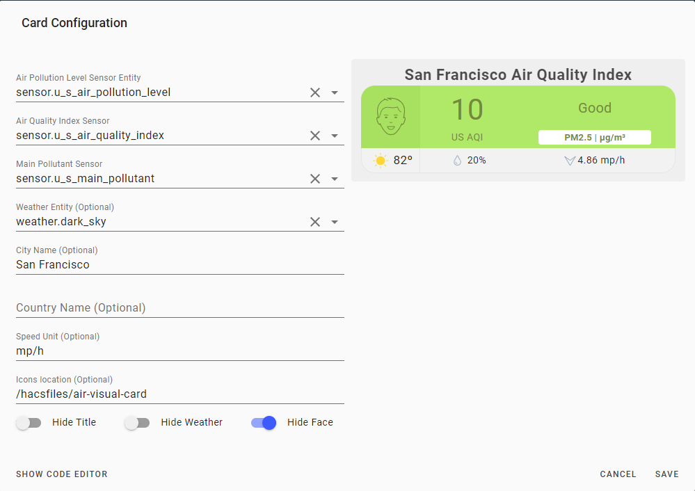

# Air Visual Card


This is a Home Assistant Lovelace card that uses the [AirVisual component](https://www.home-assistant.io/integrations/airvisual/) or [World Air Quality Index (WAQI) component](https://www.home-assistant.io/integrations/waqi/) to provide air quality index (AQI) data and creates a card like the ones found on [AirVisual website](https://www.airvisual.com). Requires the [AirVisual component](https://www.home-assistant.io/integrations/airvisual/) or [World Air Quality Index (WAQI) component](https://www.home-assistant.io/integrations/waqi/). Tested with Yahoo and Darksky Weather component.

## Features
  - Card colors and icons change depending on AQI level


## Options

### Main Options

| Name                  | Type    | Default                      | Supported options                | Description                                                  |
| --------------------- | ------- | ---------------------------- | -------------------------------- | ------------------------------------------------------------ |
| `type`                | string  | **Required**                 | `custom:air-visual-card`         | Type of the card                                             |
| `air_pollution_level` | string  | **Required**                 | `sensor.u_s_air_pollution_level` | Name of the Air Pollution Level sensor.                      |
| `air_quality_index`   | string  | optional                     | `sensor.u_s_air_quality_index`   | Name of the Air Quality Index sensor. If sensor does not exist, do not add this config value. |
| `main_pollutant`      | string  | optional                     | `sensor.u_s_main_pollutant`      | Name of the Main Pollutant sensor. If sensor does not exist, do not add this config value. |
| `weather`             | string  | optional                     | `weather.dark_sky`               | Name of the weather entity if you wish to display temperature, humidity and wind information on the card. |
| `country`             | string  | `US`                         | `mdi:air-conditioner`            | Name of the country that Airvisual is collecting AQI data from. |
| `city`                | string  | optional                     | `San Francisco`                  | Name of the city that AirVisual is collecting AQI data from. |
| `unit_of_measurement`                | string  | optional                     | `AQI`                  | Unit of measurement |
| `icons`               | string  | `/hacsfiles/air-visual-card` | `/hacsfiles/air-visual-card`     | The local directory where the .svg files are located. For example, 'icons: "/hacsfiles/air-visual-card"' is appropriate if this plugin is installed using HACS. If left blank, icons will be loaded from default location. |
| `hide_title`          | boolean | `true`                       | `true` | `false`                 | Set to `true` if you want to hide the title that includes the city name. Useful for minimalists or those using dark themes. |
| `hide_face`           | boolean | `false`                      | `true` | `false`                 | Set to `true` if you want to hide the face icon.             |
| `hide_weather`        | boolean | `true`                       | `true` | `false`                 | Set to `false` if you want to show the weather information from the weather entity. |


## HACS Installation
1. Open the HACS on your Home Assistant instance.
2. Open the Plugins section and click on the Air Visual Card.
3. Click on Install, then click on "Add to Lovelace"

## Manual Installation
1. Download the [AirVisual Card](https://raw.githubusercontent.com/dnguyen800/air-visual-card/master/dist/air-visual-card.js)
2. Place the file in your `config/www` folder
3. Include the card code in the Resources section of your `ui-lovelace-card.yaml` like below:

```yaml
resources:
  - url: /local/air-visual-card/air-visual-card.js
    type: js
```
4. **Optional:** If you wish to store the Airvisual icons locally, then download the icons [here](https://github.com/dnguyen800/air-visual-card/tree/master/dist).

5. Save the icons in a directory in Home Assistant, such as `/local/air-visual-card`

6. Update the card configuration in `ui-lovelace.yaml`  to include the following (use directory name in step #7):

   ```yaml
    icons: "/local/air-visual-card"
   ```

## Instructions
1. Install the [AirVisual sensor](https://www.home-assistant.io/components/sensor.airvisual/) and confirm AQI, APL, and Main Pollutant sensors are created, like below.


2. Add a card in the Lovelace UI.
3. Search for `air-visual-card` and click the search result. 
4. Fill out the card editor. 


## FAQ
 - The card doesn't show the temperature properly.
  
   Let me know which weather provider you are using and I'll try to fix the issue. I have only tested with the Yahoo! Weather component. Optionally, if you create a template sensor that reports the temperature as its state, you can use that sensor as for the temp config.

 - This card doesn't work in Fully Kiosk Browser on Amazon Fire tablets. Why?

   This card uses a new CSS function, CSS Grid Layout, which was implemented in October 2018, and isn't compatible with browsers using old versions of Android WebView. That's my guess anyways.

 - The card is showing the word 'unavailable' instead of the AQI data!
   
   Most likely your Airvisual key expired (it has a one-year expiration) and needs to be recreated. Delete and recreate a new key on airvisual.com and save the key in your HA config file.

## Support
I am studying programming as a hobby and this is my first set of Home Assistant projects. Unfortunately, I know nothing about Javascript and relied on studying other Lovelace custom cards to write this. Suggestions are welcome but no promises if I can fix anything! If you're familiar with CSS, then you can edit the CSS style in the .js file directly.

## Credits
  - All the custom HA cards and components I studied from, including [@Arsaboo's Animated Weather card](https://github.com/arsaboo/homeassistant-config/blob/master/www/custom_ui/weather-card.js) and [Mini Media Player](https://github.com/kalkih/mini-media-player)
  - [airvisual.com](https://www.airvisual.com/) - For the card design and data
  - [Home Assistant Air Visual sensor](https://www.home-assistant.io/components/sensor.airvisual/)
  - [Weather Card](https://github.com/bramkragten/weather-card) by @bramkragten - for the visual card editor 

