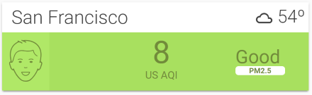
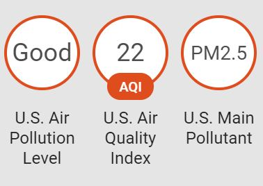

# Air Visual Card



This is a Home Assistant Lovelace card that uses the [AirVisual Sensor](https://www.home-assistant.io/components/sensor.airvisual/) to provide air quality index (AQI) data and creates a card like the ones found on [AirVisual website](https://www.airvisual.com). Requires the [AirVisual Sensor](https://www.home-assistant.io/components/sensor.airvisual/) to be setup. Tested with Yahoo and Darksky Weather component.

## Features
  - Card colors and icons change depending on AQI level


## Options

| Name | Type | Default | Description
| ---- | ---- | ------- | -----------
| air_pollution_level | string | Optional | Name of the Air Pollution Level sensor created by Airvisual component. If sensor does not exist, do not add this config value.
| air_quality_index | string | Optional | Name of the Air Quality Index sensor created by Airvisual component. If sensor does not exist, do not add this config value.
| main_pollutant | string | Optional | Name of the Main Pollutant sensor created by Airvisual component. If sensor does not exist, do not add this config value.
| temp | string | Optional| Name of the temperature sensor or weather entity, such as 'weather.yweather' or 'sensor.yweather_temperature'
| city | string | Optional | Name of the city that AirVisual is collecting AQI data from.
| hide_title | boolean | Optional | Select whether to hide the title that includes city name and temperature.
| icons | string | Optional | The local directory where the .svg files are located. For example, "icons: "/local/icons/aqi_icons" is appropriate. If left blank, icons will be loaded from Jsdeliver CDN. 


## HACS Installation
1. Open the HACS on your Home Assistant instance.
2. Go to **`Settings`**
3. Under **`Custom Repositories`**, paste the following URL: *https://github.com/dnguyen800/air-visual-card*
4. Under **`Type`**, select **`Plugin`** and click the **`Save`** icon.
5. Click on **`Install`**, and be sure to include the following in your **`ui-lovelace.yaml`**.

```yaml
- url: /community_plugin/air-visual-card/air-visual-card.js
  type: js

```
## Manual Installation
1. Download the [AirVisual Card](https://raw.githubusercontent.com/dnguyen800/air-visual-card/master/dist/air-visual-card.js)
2. Place the file in your `config/www` folder
3. Include the card code in the Resources section of your `ui-lovelace-card.yaml` like below:

```yaml
resources:
  - url: /local/air-visual-card.js
    type: js
```
4. **Optional:** If you wish to store the Airvisual icons locally, then download the icons [here](https://github.com/dnguyen800/air-visual-card/tree/master/dist).

5. Save the icons in a directory in Home Assistant, such as ''/local/icons/aqi_icons"

6. Update the card configuration in `ui-lovelace.yaml`  to include the following (use directory name in step #7):

   ```yaml
    icons: "/local/icons/aqi_icons"
   ```

## Instructions
1. Install the [AirVisual sensor](https://www.home-assistant.io/components/sensor.airvisual/) and confirm AQI, APL, and Main Pollutant sensors are created, like below.



2. Write configuration for the card in your `ui-lovelace.yaml` and list your AirVisual sensors. An example is provided below:

```yaml
  - type: custom:air-visual-card
    air_pollution_level: sensor.us_air_pollution_level
    air_quality_index: sensor.us_air_quality_index
    main_pollutant: sensor.us_main_pollutant
    temp: weather.dark_sky
    city: 'San Francisco'
```
3. Restart Home Assistant to load the card.


## FAQ
 - The card doesn't show the temperature properly
  
   Let me know which weather provider you are using and I'll try to fix the issue. I have only tested with the Yahoo! Weather component. Optionally, if you create a template sensor that reports the temperature as its state, you can use that sensor as for the temp config.

 - This card doesn't work in Fully Kiosk Browser on Amazon Fire tablets. Why?

   This card uses a new CSS function, CSS Grid Layout, which was implemented in October 2018, and isn't compatible with browsers using old versions of Android WebView. That's my guess anyways.


## Support
I am studying programming as a hobby and this is my first set of Home Assistant projects. Unfortunately, I know nothing about Javascript and relied on studying other Lovelace custom cards to write this. Suggestions are welcome but no promises if I can fix anything! If you're familiar with CSS, then you can edit the CSS style in the .js file directly.

## Credits
  - All the custom HA cards and components I studied from, including [@Arsaboo's Animated Weather card](https://github.com/arsaboo/homeassistant-config/blob/master/www/custom_ui/weather-card.js) and [Mini Media Player](https://github.com/kalkih/mini-media-player)
  - [airvisual.com](https://www.airvisual.com/) - For the card design and data
  - [Home Assistant Air Visual sensor](https://www.home-assistant.io/components/sensor.airvisual/)

