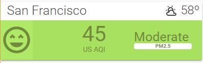

# Air-Visual-Card



This is a Home Assistant Lovelace card that takes uses the [AirVisual Sensor](https://www.home-assistant.io/components/sensor.airvisual/) and creates a card like the ones found on [AirVisual website](https://www.airvisual.com). Requires the [AirVisual Sensor](https://www.home-assistant.io/components/sensor.airvisual/) to be setup.

## Features
  - Card colors and icons change depending on AQI level
  
  
## Options

| Name | Type | Default | Description
| ---- | ---- | ------- | -----------
| entity_air_pollution_level | string | **Required** | Name of the Air Pollution Level sensor created by Airvisual component.
| entity_air_quality_index | string | **Required** | Name of the Air Quality Index sensor created by Airvisual component.
| entity_main_pollutant | int | **Required** | Name of the Main Pollutant sensor created by Airvisual component.
| entity_temp | string | '' | Name of the temperature sensor from a weather component, such as [Yahoo Weather Sensor](https://www.home-assistant.io/components/sensor.yweather/) 
| city | string | '' | Name of the city that AirVisual is collecting AQI data from.


## Instructions
1. Install the [AirVisual sensor](https://www.home-assistant.io/components/sensor.airvisual/) and confirm AQI, APL, and Main Pollutant sensors are created.
1. Download the [AirVisual Card](https://raw.githubusercontent.com/dnguyen800/Air-Visual-Card/master/air-visual-card.js)
2. Place the file in your `config/www` folder
3. Include the card code in your `ui-lovelace-card.yaml`
```yaml
resources:
  - url: /local/air-visual-card.js?v=0
    type: js
```
4. Write configuration for the card in your `ui-lovelace.yaml` and add your sensor and Spotify media player.

```yaml
  - type: custom:air-visual-card
    entity_air_pollution_level: sensor.us_air_pollution_level
    entity_air_quality_index: sensor.us_air_quality_index
    entity_main_pollutant: sensor.us_main_pollutant
    entity_temp: sensor.yweather_temperature
    city: 'San Francisco'
```

## FAQ
 - This card doesn't work in Fully Kiosk Browser on Amazon Fire tablets. Why?

   This card uses a new CSS function, CSS Grid Layout, which was implemented in October 2018, and isn't compatible with browsers using old versions of Android WebView. That's my guess anyways.

 
## Support
I am studying Python as a hobby and this is my first public project. Unfortunately, I know nothing about Javascript and relied on studying other Lovelace custom cards to write this. Suggestions are welcome but no promises if I can fix anything! If you're familiar with CSS, then you can edit the CSS style in the .js file directly!

## Credits
  - [Tracker-card](https://github.com/custom-cards/tracker-card) which I studied and re-used the button code.
  - [@Arsaboo's Animated Weather card](https://github.com/arsaboo/homeassistant-config/blob/master/www/custom_ui/weather-card.js)
  - [airvisual.com](https://www.airvisual.com/)
  - [Home Assistant Air Visual sensor](https://www.home-assistant.io/components/sensor.airvisual/)

